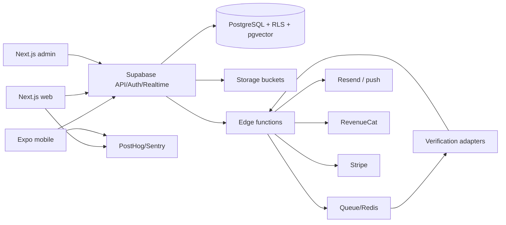

# System architecture

```mermaid
flowchart LR
  M[Expo mobile] --> S[Supabase API/Auth/Realtime]
  W[Next.js web] --> S
  A[Next.js admin] --> S
  S --> P[(PostgreSQL + RLS + pgvector)]
  S --> O[Storage buckets]
  S --> E[Edge functions]
  E --> Q[Queue/Redis]
  Q --> V[Verification adapters]
  V --> E
  E --> N[Resend / push]
  E --> RC[RevenueCat]
  E --> ST[Stripe]
  W --> AN[PostHog/Sentry]
  M --> AN
```
