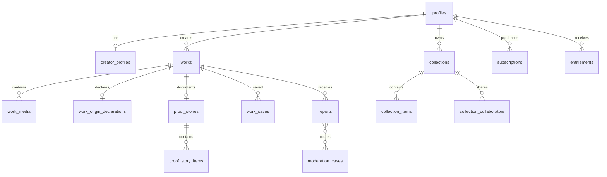

# Database diagram

```mermaid
erDiagram
  profiles ||--o| creator_profiles : has
  profiles ||--o{ works : creates
  works ||--o{ work_media : contains
  works ||--o| work_origin_declarations : declares
  works ||--o| proof_stories : documents
  proof_stories ||--o{ proof_story_items : contains
  profiles ||--o{ collections : owns
  collections ||--o{ collection_items : contains
  collections ||--o{ collection_collaborators : shares
  works ||--o{ work_saves : saved
  works ||--o{ reports : receives
  reports }o--o{ moderation_cases : routes
  profiles ||--o{ subscriptions : purchases
  profiles ||--o{ entitlements : receives
```
