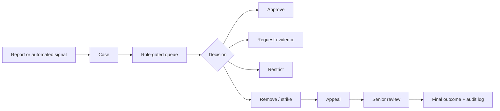

# Moderation flow

```mermaid
flowchart LR
 R[Report or automated signal] --> C[Case]
 C --> Q[Role-gated queue]
 Q --> D{Decision}
 D --> A[Approve]
 D --> E[Request evidence]
 D --> L[Restrict]
 D --> X[Remove / strike]
 X --> AP[Appeal]
 AP --> SR[Senior review]
 SR --> O[Final outcome + audit log]
```
