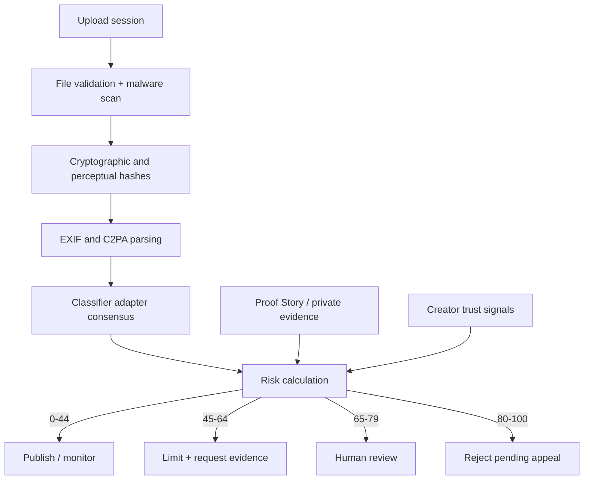

# Verification flow

```mermaid
flowchart TD
 U[Upload session] --> F[File validation + malware scan]
 F --> H[Cryptographic and perceptual hashes]
 H --> M[EXIF and C2PA parsing]
 M --> C[Classifier adapter consensus]
 C --> R[Risk calculation]
 P[Proof Story / private evidence] --> R
 T[Creator trust signals] --> R
 R -->|0-44| PUB[Publish / monitor]
 R -->|45-64| LIM[Limit + request evidence]
 R -->|65-79| REV[Human review]
 R -->|80-100| REJ[Reject pending appeal]
```
